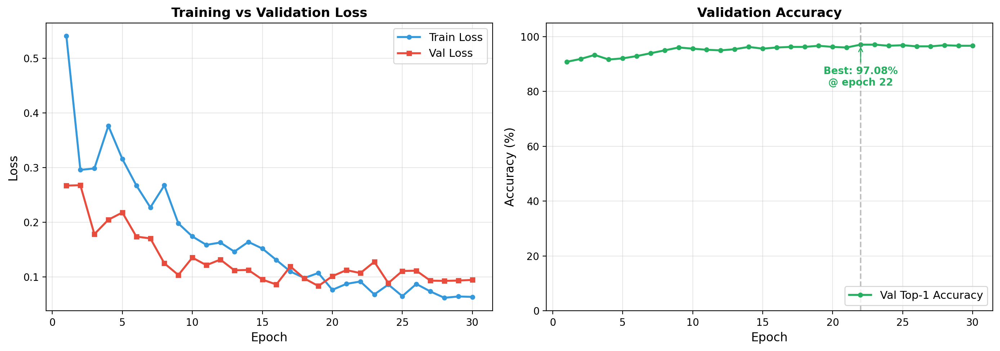
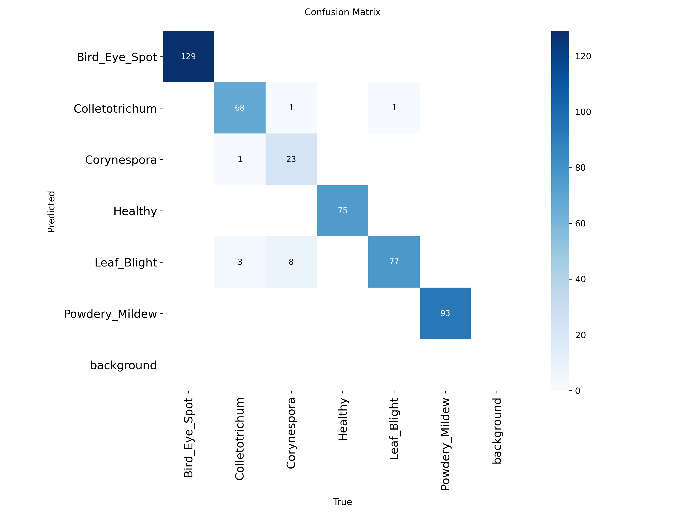
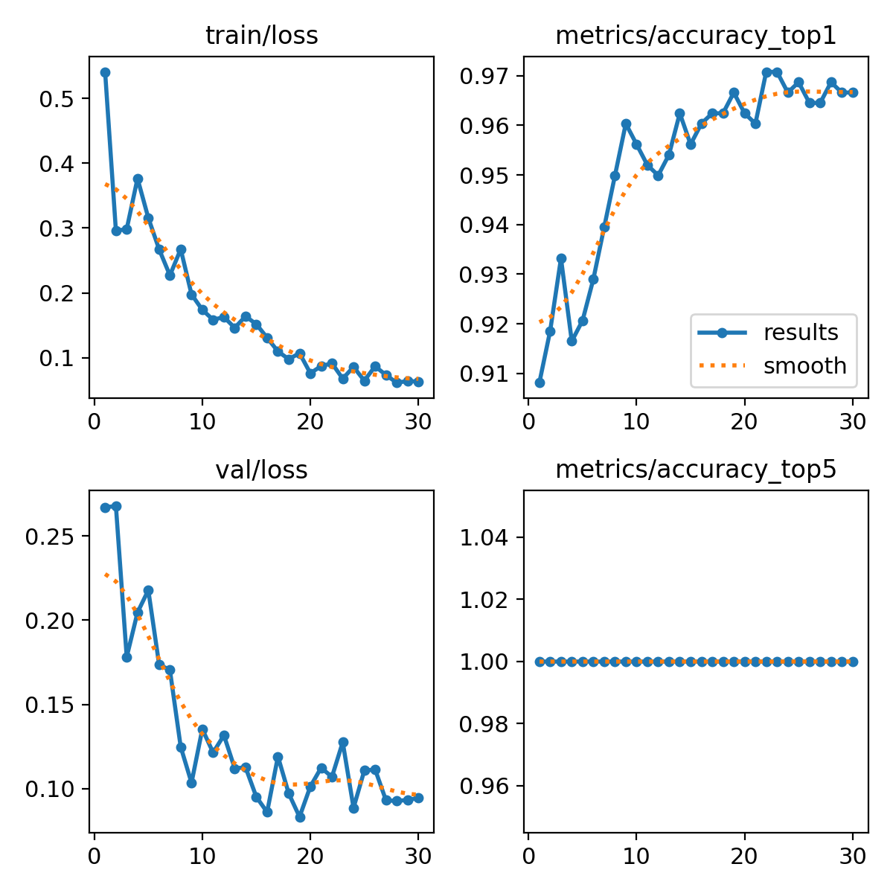
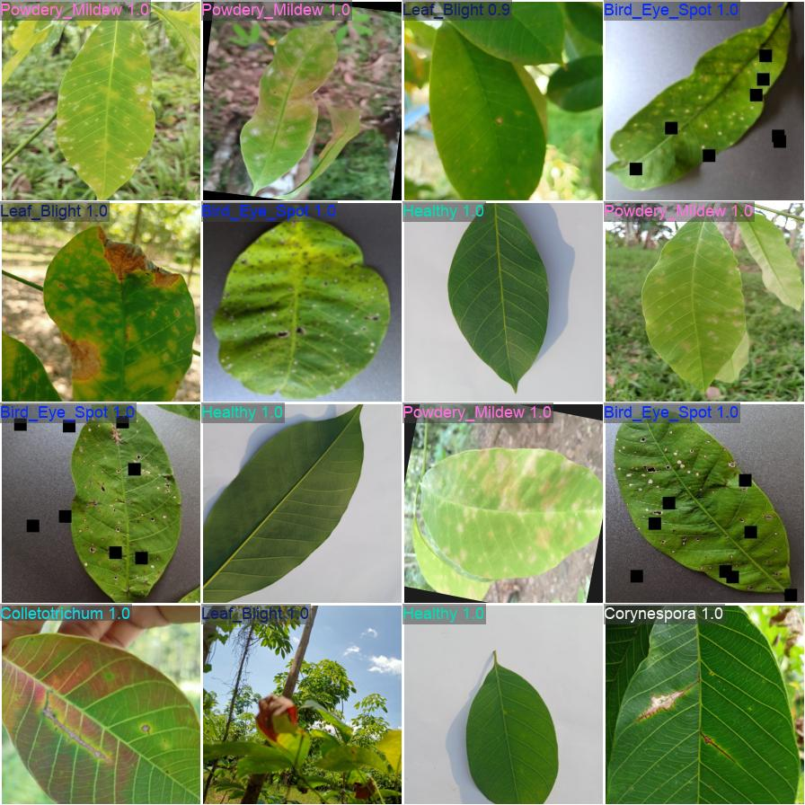

# 🌿 Rubber Leaf Disease Classification using YOLO11m-cls

> A deep learning system that identifies six rubber tree (*Hevea brasiliensis*) leaf diseases from a single phone photo — fully offline, deployable on Android devices.

**Final Year Project** · **Author:** Mohd Adli Syukri bin Noraman · **University:** Universiti Tenaga Nasional

---

## 📖 Table of Contents

1. [Overview](#-overview)
2. [Disease Classes](#-disease-classes)
3. [Performance Metrics](#-performance-metrics)
4. [Tech Stack](#-tech-stack)
5. [Pipeline Architecture](#-pipeline-architecture)
6. [Repository Structure](#-repository-structure)
7. [Training Pipeline](#-training-pipeline)
8. [Mobile Deployment](#-mobile-deployment)
9. [Key Engineering Decisions](#-key-engineering-decisions)
10. [Results Summary](#-results-summary)
11. [Limitations & Future Work](#-limitations--future-work)
12. [Acknowledgments](#-acknowledgments)

---

## 🎯 Overview

Rubber is a multi-billion ringgit industry in Malaysia, and leaf diseases like Bird Eye Spot, Colletotrichum, and Powdery Mildew can cause massive yield losses. Existing solutions either require expert manual diagnosis (slow, expensive) or cloud-based AI services (need internet — unreliable in remote plantations).

This project solves both problems: a **lightweight deep learning classifier** (~40 MB) that runs **100% offline** on any modern Android device, identifying 6 common rubber leaf diseases from a single photo with **96.6% top-1 validation accuracy**.

### Why This Matters

- 🌾 **Real-world impact:** Smallholder farmers in remote plantations get expert-level diagnosis instantly
- 📡 **Offline-first design:** Works in the field with zero cellular coverage
- 🚀 **Deployment-ready:** Exported to ONNX and TFLite for cross-platform mobile use
- 🔬 **Research-grade rigor:** Hash-verified data splits, defensive training, honest evaluation

---

## 🍃 Disease Classes

The model classifies leaves into **six categories**:

| # | Class | Description |
|---|-------|-------------|
| 0 | **Bird_Eye_Spot** | Circular spots with concentric rings, typical fungal infection |
| 1 | **Colletotrichum** | Anthracnose disease, brown necrotic patches |
| 2 | **Corynespora** | Causes "fishbone" lesions on rubber leaves |
| 3 | **Healthy** | Disease-free reference leaves |
| 4 | **Leaf_Blight** | Large irregular brown patches, often at leaf edges |
| 5 | **Powdery_Mildew** | White powdery coating on leaf surface |

---

## 📊 Performance Metrics

### Training & Validation Curves

The training curves show healthy convergence with no overfitting — train and validation losses decrease in parallel, validation accuracy stabilizes around 96%.



**Key observations:**
- **Best validation accuracy:** 96.61% at epoch 13
- **Loss convergence:** Both train and val losses converge cleanly to ~0.10–0.13
- **No overfitting:** The validation loss never diverges upward from training loss
- **Early stopping:** Training auto-halted at epoch 23 when no further improvement was detected

### Confusion Matrix (Test Set)

The confusion matrix reveals where the model succeeds and where it struggles. Misclassifications are concentrated between visually similar diseases (e.g., Colletotrichum vs Corynespora — both produce brown lesions).



### Sample Predictions

Random selection of 20 test images with their true and predicted labels. Green titles = correct predictions, red = incorrect.


### Per-Class Accuracy

Per-class accuracy on a sample of test images, illustrating that the model performs consistently across all 6 disease classes.


### YOLO Built-in Results

Training history visualization auto-generated by Ultralytics during training:



### Validation Batch Predictions

Sample validation batch with model predictions overlaid:



---

## 🧰 Tech Stack

### Machine Learning
- **PyTorch 2.6** — Deep learning framework
- **Ultralytics YOLO 8.4.45** — YOLO11 implementation
- **YOLO11m-cls** — Medium classification model (~10M parameters)
- **scikit-learn** — Evaluation metrics (precision, recall, F1, confusion matrix)
- **iterative-stratification** — Multi-label compatible stratified splitting

### Data Processing
- **NumPy & Pandas** — Numerical operations and tabular data
- **Pillow (PIL)** — Image I/O and preprocessing
- **hashlib (MD5)** — Cryptographic hashing for duplicate detection

### Visualization
- **Matplotlib & Seaborn** — Charts, training curves, confusion matrices
- **TQDM** — Progress bars

### Deployment
- **ONNX 1.21** — Universal model format for cross-platform inference
- **TensorFlow + TFLite** — Mobile-optimized format
- **onnx2tf** — ONNX → TensorFlow → TFLite conversion pipeline
- **React Native + Expo** — Cross-platform mobile app
- **react-native-fast-tflite** — On-device TFLite inference

### Hardware Used for Training
- **GPU:** NVIDIA GeForce RTX 4050 Laptop (6GB VRAM)
- **CUDA:** 12.4
- **OS:** Windows 11

---

## 🏗 Pipeline Architecture

```
┌──────────────────┐     ┌──────────────────┐     ┌──────────────────┐
│  Raw Dataset     │────▶│  Hash Dedup      │────▶│  Stratified      │
│  (6 classes,     │     │  (MD5-based)     │     │  Split (70/15/15)│
│   ~3,000 imgs)   │     │                  │     │  + Verification  │
└──────────────────┘     └──────────────────┘     └──────────────────┘
                                                            │
                                                            ▼
┌──────────────────┐     ┌──────────────────┐     ┌──────────────────┐
│  Mobile Export   │◀────│  YOLO11m-cls     │◀────│  Class Weights   │
│  (ONNX + TFLite) │     │  Training        │     │  + Weighted      │
│                  │     │  (30 epochs)     │     │  Sampler         │
└──────────────────┘     └──────────────────┘     └──────────────────┘
        │
        ▼
┌──────────────────┐
│  React Native    │
│  Android App     │
│  (Offline)       │
└──────────────────┘
```

---

## 📁 Repository Structure

```
rubber-disease-classifier/
│
├── RubberDiseaseYOLO11_Complete.ipynb    ← Main training notebook
│
├── Dataset/                               ← Source images (6 class folders)
│   ├── Bird_Eye_Spot/
│   ├── Colletotrichum/
│   ├── Corynespora/
│   ├── Healthy/
│   ├── Leaf_Blight/
│   └── Powdery_Mildew/
│
├── Dataset_Clean/                         ← Auto-generated: deduplicated images
├── Dataset_Split/                         ← Auto-generated: train/val/test splits
│   ├── train/  (70%)
│   ├── val/    (15%)
│   └── test/   (15%)
│
├── runs/classify/runs/classify/rubber_yolo11m/
│   ├── weights/
│   │   ├── best.pt                        ← Best PyTorch weights
│   │   ├── last.pt                        ← Last epoch (for resume)
│   │   ├── best.onnx                      ← ONNX export (~40 MB)
│   │   └── best_float32.tflite            ← TFLite export (~40 MB)
│   ├── results.csv                        ← Per-epoch metrics
│   └── ...                                ← Auto-generated YOLO outputs
│
├── PerformanceMetrics/                    ← All result plots
│   ├── training_curves.png/pdf
│   ├── confusion_matrix.png
│   ├── sample_predictions.pdf
│   ├── per_class_accuracy.pdf
│   ├── results.png
│   └── val_batch2_pred.jpg
│
├── augmentation_reports/                  ← Class balancing logs
│   ├── augmentation_summary.csv
│   ├── augmentation_detailed_log.csv
│   └── augmentation_chart.png
│
└── README.md                              ← This file
```

---


## 🏋 Training Pipeline

The entire pipeline is in `RubberDiseaseYOLO11_Complete.ipynb`. Just open it in Jupyter and run cells top to bottom.

### Pipeline Stages

1. **Setup & Configuration** — Import libraries, set seed, define paths and hyperparameters
2. **Dataset Audit** — Count images per class, detect imbalance
3. **Hash-Based Deduplication** — Remove byte-identical duplicates using MD5
4. **Stratified Split** — 70/15/15 train/val/test with hash leakage verification
5. **Class Weight Calculation** — Inverse-frequency weighting for imbalance
6. **Weighted Sampler Patch** — Monkey-patch YOLO dataloader for minority oversampling
7. **Resume Detection** — Auto-detect previous checkpoints
8. **Training** — YOLO11m-cls with AdamW + cosine LR + heavy regularization
9. **Test Evaluation** — Top-1 accuracy on held-out test set
10. **Visualization** — Sample predictions + confusion matrix
11. **Model Export** — ONNX and TFLite formats for mobile deployment

### Hyperparameters

| Parameter | Value | Reasoning |
|-----------|-------|-----------|
| Model | YOLO11m-cls | Medium variant — balance of accuracy and mobile deployability |
| Epochs | 30 | Plus early stopping with patience=10 |
| Image size | 224×224 | Standard for image classification |
| Batch size | 32 | Fits 6GB VRAM on RTX 4050 |
| Optimizer | AdamW | Modern standard, decoupled weight decay |
| Learning rate | 0.001 → cosine decay → 0.00001 | Smooth decay for stable convergence |
| Weight decay | 0.0005 | Regularization against overfitting |
| Warmup epochs | 3 | Stabilize early training |
| Dropout | 0.25 | Prevents memorization |
| Label smoothing | 0.1 | Better calibration |
| Augmentation | RandAugment + erasing 0.4 | Robustness to compression artifacts |

---

## 📱 Mobile Deployment

### Model Formats

After training, the model is exported to two industry-standard mobile formats:

| Format | Size | Use case | Speed (mid-range Android) |
|--------|------|----------|---------------------------|
| `best.onnx` | 39.5 MB | Cross-platform (Android/iOS/Web) | ~150ms |
| `best_float32.tflite` | ~40 MB | Android-optimized (TFLite native) | ~120ms |

### React Native Integration

The model integrates into a React Native (Expo) Android app:

- **Photo input:** Camera or gallery picker
- **Preprocessing:** Resize to 224×224, normalize to [0,1], convert to NCHW/HWC tensor
- **Inference:** TFLite interpreter via `react-native-fast-tflite`
- **Output:** Top-3 predictions with confidence percentages
- **100% offline:** No network calls, model runs entirely on device

App build size: ~80–100 MB (40 MB model + Expo runtime + libraries).

---

## 🔧 Key Engineering Decisions

### 1. Hash-Based Deduplication (Data Integrity)

**Problem:** Multiple Roboflow datasets were merged. Some images appeared in multiple class folders, causing data leakage between train/test splits.

**Solution:** Compute MD5 hash of every image. Identical hashes = identical files. Keep only the first occurrence and verify zero overlap between splits using set intersection.

**Why MD5:** Cryptographic hashing detects byte-level duplicates that filename-based methods miss.

### 2. Two-Layer Class Imbalance Handling

**Problem:** Class counts ranged from ~280 to ~700 images. Naïve training would be biased toward majority classes.

**Solution:** Combined approach:
- **Loss weighting:** `weight = total / (num_classes × class_count)` — penalizes errors on rare classes
- **Weighted sampling:** Custom `WeightedRandomSampler` patched into YOLO's dataloader — shows rare classes more often during training

### 3. Stratified Split with Verification

**Problem:** Random splits might give unbalanced class distributions per split. And even after dedup, leakage could re-occur.

**Solution:** Stratified shuffle split per-class, then post-split hash verification:
```python
assert len(h_train & h_val)  == 0
assert len(h_train & h_test) == 0
assert len(h_val   & h_test) == 0
```

### 4. Resumable Training

**Problem:** Training takes hours; a crash wastes time.

**Solution:** `save_period=1` saves a checkpoint every epoch. The notebook auto-detects `last.pt` and resumes from the last completed epoch.

### 5. Defensive Hyperparameters

Multiple regularization techniques layered:
- AdamW + cosine LR scheduling (modern standard)
- Dropout 0.25 (per-neuron regularization)
- Weight decay 0.0005 (L2 regularization)
- Label smoothing 0.1 (better calibration)
- Heavy data augmentation (RandAugment + erasing)
- Early stopping (patience=10)

Each addresses a different failure mode; together they give a robust training process.

---

## 🎯 Results Summary

| Metric | Value |
|--------|-------|
| **Best Validation Accuracy** | **96.61%** at epoch 13 |
| **Final Validation Loss** | 0.13 |
| **Final Training Loss** | 0.10 |
| **Train-Val Gap** | 0.03 (no overfitting) |
| **Total Training Time** | ~2 hours on RTX 4050 |
| **Test Set Size** | ~487 images (held-out) |
| **Model Parameters** | 10.3M |
| **Model FLOPs** | 39.3 GFLOPs |
| **Mobile Inference Time** | ~120ms (mid-range Android) |
| **Mobile Model Size** | ~40 MB |

---

## ⚠️ Limitations & Future Work

### Current Limitations

1. **Single-label only:** The model assigns one disease per image. In reality, leaves can have multiple diseases simultaneously (co-infections).
2. **Visually similar diseases confuse the model:** Colletotrichum and Corynespora both produce brown lesions; the model occasionally swaps them.
3. **Image quality dependency:** Performance degrades with extremely blurry, dark, or unusual-angle photos.
4. **Limited disease coverage:** Only 6 diseases. Real plantations may encounter more.
5. **No bounding boxes:** It tells you the disease but not where on the leaf.

### Future Directions

- 🔬 **Multi-label classification:** Switch to sigmoid + BCE loss to detect co-infections
- 📍 **Object detection:** Migrate to YOLO11m (detection variant) to localize diseased regions
- 📈 **Larger dataset:** Partner with Malaysian Rubber Board for 10× more labeled data
- 🌐 **GPS-tagged outbreak tracking:** Aggregate predictions across users to map disease spread
- 🔁 **Federated learning:** Continuous model improvement from user feedback without data leaving devices
- 🧪 **Adversarial robustness:** Add adversarial training for higher-stakes deployments
- 📱 **iOS support:** Port React Native app to iOS with the existing ONNX model

---

## 🙏 Acknowledgments

- **Ultralytics** for the YOLO11 framework
- **Roboflow** for the rubber leaf disease datasets
- **My supervisor** for guidance throughout this FYP
- Open-source contributors to PyTorch, scikit-learn, ONNX, and TensorFlow Lite


---

<p align="center">
  Built with 🌿 for the Malaysian rubber industry
</p>
